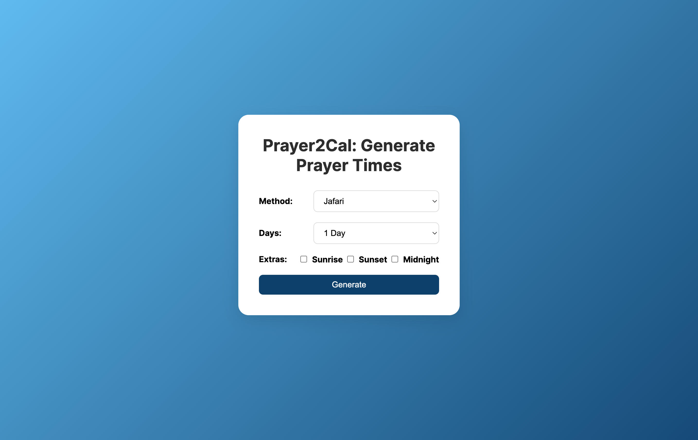

# Prayer2Cal: Generate Prayer times for Your Calendar

## Overview

This project is a Flask-based web application that generates iCal files for Islamic prayer times. Users can select a custom calculation method, specify the number of days for which they want the prayer times, and optionally include extra times like sunrise and sunset.

## Features

- Generate iCal files for Islamic prayer times
- Supports multiple calculation methods (Jafari, MWL, ISNA, etc.)
- Uses [praytimes.org](https://praytimes.org) for caluclation
- Option to include extra times like sunrise and sunset
- Automatically detects the user's timezone based on latitude and longitude

## Requirements

- Python 3.x
- Flask
- TimezoneFinder
- iCalendar
- pytz

## Installation

1. Clone the repository:

    ```bash
    git clone https://github.com/mhadimedia/Prayer2Cal.git
    ```

2. Navigate to the project directory:

    ```bash
    cd Prayer2Cal
    ```

3. Install the required packages:

    ```bash
    pip install -r requirements.txt
    ```

## Usage

1. Run the Flask application:

    ```bash
    python app.py
    ```

2. Open your web browser and navigate to `http://127.0.0.1:5000/`.

3. Fill in the form with the required details and click "Generate" to download the iCal file.

## License

This project is licensed under the MIT License. See the [LICENSE](LICENSE) file for details.